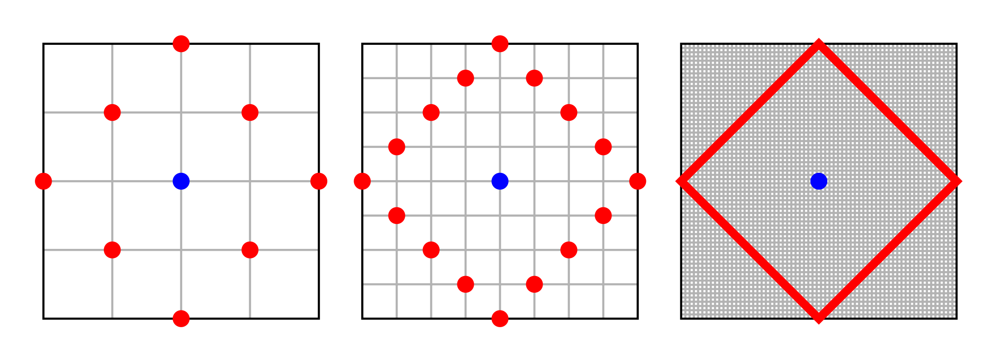
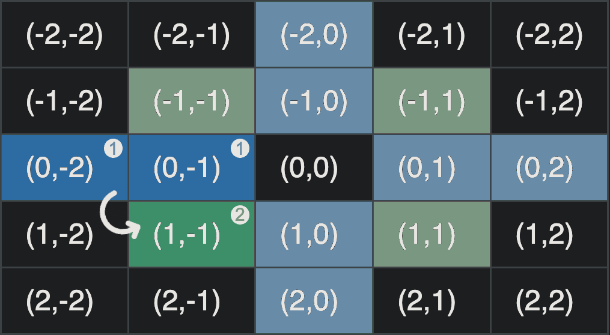

<h1 align="center"> SmartParking </h1>

## GestionarSolicitudReserva

En este apartado nos gustaría dar información adicional sobre el algoritmo que utilizamos en la clase ***reservaInmediata***. Dados el origen $\bar{o} = ( i, j )$ 
y un radio máximo $n$, genera los vecinos a $\bar{o}$ y los ordena en sentido antihorario, de menor a mayor distacia, en el espacio métrico del taxista en $\mathbb{R}^2$.

### Panorámica

Para realizar la reserva, el proceso que seguimos en pseudocódigo es:

``` python
Input: radioMax = n, o = [i, j]  
Init: reservado <- False, dist <- 1

while not reservado and dist <= n:
    generarVecinos(radio = dist, origen = [i, j])
    quitarVecinosFueraDeRango()
    ordenarPorPrecio()

    reservado <- intentarReservarEnOrden()
    dist <- dist + 1
```

De este modo, en cada iteración $i$, generamos las coordenadas adyacentes (vecinos) con $dist = i \in \lbrace 1, \dots, n \rbrace$ en orden antihorario.
Tras eliminar aquellos que están fuera de rango y reordenarlos según su precio, intentamos reservar plaza en la primera zona que podamos, siguiendo el orden definido.
Si se logra reservar en alguna, se sale del bucle; en otro caso se repite el proceso con $dist = i + 1$.
La ejecución finaliza si se logra reservar plaza en alguna de las iteraciones, o si no se logra reservar en ningún vecino con $dist \leq n$.

### Desarrollo del método

La función principal es la siguiente:
```java

    @Override
    public void gestionarSolicitudReserva(GestorLocalidad gestor) {
        if (esValida(gestor)) {
    
            super.gestionarSolicitudReserva(gestor);

            if (super.getHueco() == null) {

                boolean reservado = false;

                for (int dist = 1; dist <= radio && !reservado; dist++) {

                    int[][] coords = new int[dist * 4][2];
                    generarVecinos(coords, dist, super.getIZona(), super.getJZona());

                    ArrayList<int[]> coordsValidas = new ArrayList<int[]>();
                    anadirCoordsValidas(coordsValidas, coords, gestor);
                    ordenarPorPrecio(coordsValidas, gestor);

                    reservado = intentarReservar(coordsValidas, gestor);
                }
            }
        }
    }

```

Tras comprobar la validez del gestor, si no se consigue reservar plaza en la zona deseada se comienza a buscar en los alrededores. De este modo comenzamos a recorrer las plazas, comenzando por aquellas a menor distancia, en el bucle principal, creando en cada iteración un *array* bidimensional de tamaño $4·dist \times 2$, que almacene los vecinos a distancia $dist$. A continuación se llama a ***generarVecinos()*** que rellena el *array* **coords** de estos vecinos, colocándolos en orden antihorario.

```java
for (int dist = 1; dist <= radio && !reservado; dist++) {

    int[][] coords = new int[dist * 4][2];
    generarVecinos(coords, dist, super.getIZona(), super.getJZona());

    ...

}

```

En la geometría de Manhattan se cumple que $dist(\bar{v},\bar{v}') = |x - x'| + |y - y'|$, por lo que todos los puntos del conjunto $C_n(\bar{o}) = \lbrace (x, y): dist(\bar{o}, \bar{x}) = n\rbrace$ forman un cuadrado en lugar de un círculo. Además, se verifica que el número de puntos o celdas en $B_n(\bar{o})$, será $4·n$, es decir, que la circunferencia de un círculo de radio $n$ será $4·n$. Es por esto que se elige este tamaño para el *array* **coords**.



Adicionalmente nótese que el número de celdas dentro del conjunto $\overline{B_n}(\bar{o}) = \lbrace(x, y): dist(\bar{o}, \bar{x}) \leq n\rbrace$, por lo discutido, será: $$1 + 4·1 + 4·2 + \dots + 4·n = 1 + 4·\displaystyle\sum_{i=1}^{n} i = 4·\frac{n·(n + 1)}{2} + 1 = 2·n·(n + 1) + 1$$

En conclusión, en este espacio, un círculo de radio $n$ tendrá una circunferencia de $4·n$, y un área de $2·n·(n + 1) + 1$.

```java
for (int dist = 1; dist <= radio && !reservado; dist++) {

    ...

    ArrayList<int[]> coordsValidas = new ArrayList<int[]>();
    anadirCoordsValidas(coordsValidas, coords, gestor);
    ordenarPorPrecio(coordsValidas, gestor);   //BubbleSort

    reservado = intentarReservar(coordsValidas, gestor);
}

```

Después de generar los vecinos, se añaden al *ArrayList* **coordsValidas** aquellas coordenadas que existan en el *GestorLocalidad* **gestor** en el método ***anadirCoordsValidas()***, y se ordenan utilizando un BubbleSort en ***ordenarPorPrecio()***.
Como las coordenadas de **coords** se colocan en el *array* en orden antihorario, y al ordenarlos en el *BubbleSort* no se altera el orden de dos elementos con el mismo precio, dos coordenadas con el mismo precio quedarán ordenadas en sentido antihorario.

Finalmente, una vez se tienen todas las coordenadas válidas, se intenta hacer una reserva en aquella más óptima según el orden definido en ***intentarReserva()***, hasta que se tenga éxito o se fracase en todas las coordenadas con $dist \leq n$.

#### Función generarVecinos

De todas las funciones auxiliares, tan solo se comentará ***generarVecinos()*** ya que el resto son bastante triviales, y no hay mucho contenido que explicar. La función es la siguiente:

```java
private void generarVecinos(int[][] coords, int dist, int iZona, int jZona) {

    int[] inicio = {0, -dist};
    int[] vecDir = {1, 1};

    int[] orig = {iZona, jZona};

    for (int offset = 0; offset < dist; offset++) {
        coords[dist*0 + offset] = new int[] {     inicio[0] + orig[0],      inicio[1] + orig[1]};
        coords[dist*1 + offset] = new int[] {-1 * inicio[1] + orig[0],      inicio[0] + orig[1]};
        coords[dist*2 + offset] = new int[] {-1 * inicio[0] + orig[0], -1 * inicio[1] + orig[1]};
        coords[dist*3 + offset] = new int[] {     inicio[1] + orig[0], -1 * inicio[0] + orig[1]};

        inicio[0] += vecDir[0];
        inicio[1] += vecDir[1];
    }
}
```
Para generar los vecinos a una distancia dada en orden antihorario, aprovechamos la simetría de las coordenadas cuando el centro es el origen $( 0, 0 )$. 

Para hallarlas, utilizamos el siguiente método:  
Sean $dist = n$, la distancia dada y &nbsp; $\bar{v_1} = ( i, j )$ &nbsp; una coordenada en la posición &nbsp; $k \in \lbrace0, \dots, \frac{4·n}{4} - 1 \rbrace$  
$\implies$ La cordenada en la posición &nbsp; $1·n + k$ &nbsp;será &nbsp; $\bar{v_2} = (-j,  i )$  
$\implies$ La cordenada en la posición &nbsp; $2·n + k$ &nbsp;será &nbsp; $\bar{v_3} = (-i, -j )$  
$\implies$ La cordenada en la posición &nbsp; $3·n + k$ &nbsp;será &nbsp; $\bar{v_4} = ( j, -i )$  



Ilustraremos ahora como funciona el algoritmo, considerando como centro dado la coordenada $(x, y)$:
- **Distancia 1:** Comenzamos en la casilla a la izquierda del origen, la $(0, -1)$, que colocamos en la posición 0 del *array* ***coords***. A continuación generamos el resto de coordenadas usando el método anterior, colocándolas en las posiciones 1, 2 y 3 respectivamente. Ya hemos generado los cuatro vecinos a distancia 1, luego hemos acabado. Finalmente para que el centro sea el punto $(x, y)$, en lugar del $(0, 0)$, le sumamos $(x, y)$ a todas las coordenadas para trasladarlas.

- **Distancia 2:** Comenzamos en la casilla a la izquierda del origen y distancia 2, la $(0, -2)$, que colocamos en la posición 0 del *array* ***coords***. A continuación generamos las coordenadas en las posiciones 2, 4 y 6 respectivamente. Ahora nos desplazamos diagonalmente, recorriendo el lado del cuadrado, hasta el vector $(0, -2) + (1, 1) = (1, -1)$, lo colocamos en la posicion 1 y generamos las coordenadas en las posiciones 3, 5 y 7 respectivamente. Ya hemos generado los ocho vecinos a distancia 2, luego hemos acabado. De neuvo, trasladamos todas las coordenadas sumándolas $(x, y)$.

- **Distancia** $i$ **:** Comenzamos en la casilla $(0, -i)$ y la colocamos en la posición 0 del *array*. A continuación generamos con esta coordenada las casillas en las posiciones &nbsp; $n + i$, &nbsp; $2·n + i$ &nbsp; y &nbsp; $3·n + i$. Ahora le sumamos a esta casilla inicial $(1, 1)$ para llegar a la casilla $(1, 1 - i)$ y continuamos este proceso $i$ veces hasta terminar de generar todos los vecinos del origen a distancia $i$. Acabamos trasladando las coordenadas.

Por tanto en este algoritmo recorremos tan solo un lado de los cuatro del cuadrado que forman las $4·n$ celdas a una distacia $n$, comenzando en la esquina izquierda y avanzando según la dirección de ***vecDir***, hasta recorrer $n$ celdas ($\frac{1}{4}$ de todas), generando con ellas el resto de coordenadas, de forma que estén en orden antihorario.  
Una vez se tienen los vecinos con origen en $( 0, 0 )$, se trasladan sumando ***(iZona, jZona)***.

Luego, sea $n$ el radio máximo dado, se tendrán que generar $2·n·(n + 1)$ coordenadas, que el algoritmo generará en ese mismo número de iteraciones. Por tanto, el algoritmo tiene una complejidad $O(n)$, es decir, lineal.
